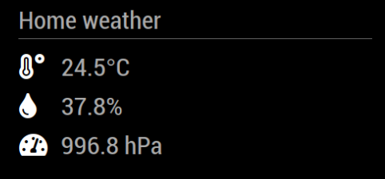
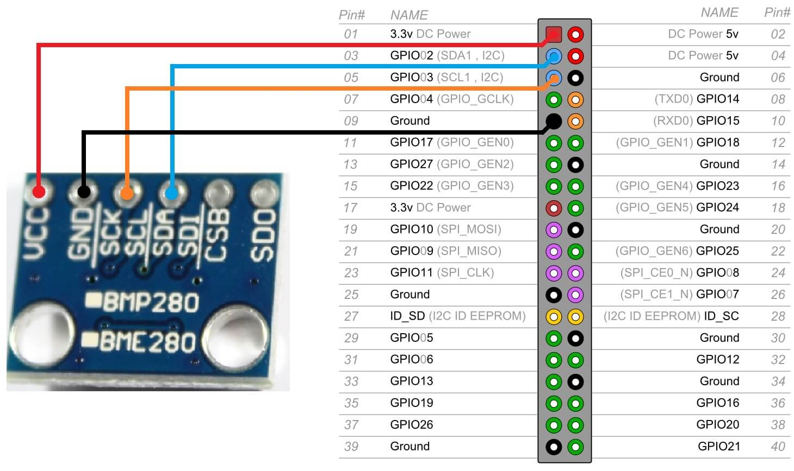

# MMM-BME280

This is an extension for the [MagicMirror²](https://github.com/MichMich/MagicMirror).
It monitors temperature, humidity and air pressure from [BME-280 sensor](https://www.bosch-sensortec.com/products/environmental-sensors/humidity-sensors-bme280).



## Installation
1. Navigate into your MagicMirror's `modules` folder
2. Clone repository `git clone https://github.com/awitwicki/MMM-BME280`
3. Go to newly created directory (`cd MMM-BME280`)
4. Execute `npm install` to install the node dependencies.
5. Connect the BME280 to your Raspberry Pi


## Using the module

Add it to the modules array in the `config/config.js` file:

````javascript
modules: [
	...
	{
		module: 'MMM-BME280',
		position: 'top_left',
		config: {
			updateInterval: 5 //seconds
			}
	},
	...
]
````

## Configuration options

Configurations properties

<table width="100%">
	<thead>
		<tr>
			<th>Property</th>
			<th width="100%">Description</th>
		</tr>
	<thead>
	<tbody>
		<tr>
			<td><code>titleText</code></td>
			<td>Widget title text
				<br><b>Type:</b> <code>string</code>
				<br><b>Default:</b> <code>Home weather</code>
			</td>
		</tr>
		<tr>
			<td><code>updateInterval</code></td>
			<td>Wait interval between readings of BME280 sensor values in seconds
				<br><b>Type:</b> <code>int</code>
				<br><b>Default:</b> <code>100</code>
			</td>
		</tr>
		<tr>
			<td><code>deviceAddress</code></td>
			<td>BME280 I2C address, default is 0x76
				<br><b>Type:</b> <code>hex string</code>
				<br><b>Default:</b> <code>"0x76"</code>
			</td>
		</tr>
		<tr>
			<td><code>temperatureScaleType</code></td>
			<td>Different temperature scales
				<br><b>Type:</b> <code>int</code>
				<br><b>Default:</b> <code>0</code>
				<br><b>Scale types:</b> <code>0</code> Celsius, <code>1</code> Fahrenheit
			</td>
		</tr>
		<tr>
			<td><code>pressureScaleType</code></td>
			<td>Different pressure scales
				<br><b>Type:</b> <code>int</code>
				<br><b>Default:</b> <code>0</code>
				<br><b>Scale types:</b> <code>0</code> hPa, <code>1</code> inHg
			</td>
		</tr>
	</tbody>
</table>

## Developer Notes
For more details about BCM pin numbers check [here](http://www.raspberrypi-spy.co.uk/2012/06/simple-guide-to-the-rpi-gpio-header-and-pins)

## Dependencies
- `python3` (should be installed on Raspberry Pi)
- `smbus` (Python library, install via `pip3 install smbus` )

### Test BME280 module
1. Navigate into your `MagicMirror/modules/MMM-BME280` folder
2. Run script `python3 bme280.py`
   - If you get `FileNotFoundError: [Errno 2] No such file or directory` you habe to enable i2c interface (`sudo raspi-config` > Interfacing Options > I2C > Enable)
   - If script prints `OSError: [Errno 121] Remote I/O error` then you are using wrong I2C address. Try to run `i2cdetect -y 1` console command to find out your device address.
3. Script should print sensor values like this `24.7 38.3 996.6` - that means `temperature humidity pressure`
   - If you only see `0 0 0` make sure you are not setting the PINs you are using in another program. 

### Thanks

[MMM-DHT-Sensor module](https://github.com/bernardpletikosa/MMM-DHT-Sensor)

[Using the BME280 I2C Temperature and Pressure Sensor in Python](https://www.raspberrypi-spy.co.uk/2016/07/using-bme280-i2c-temperature-pressure-sensor-in-python/)


